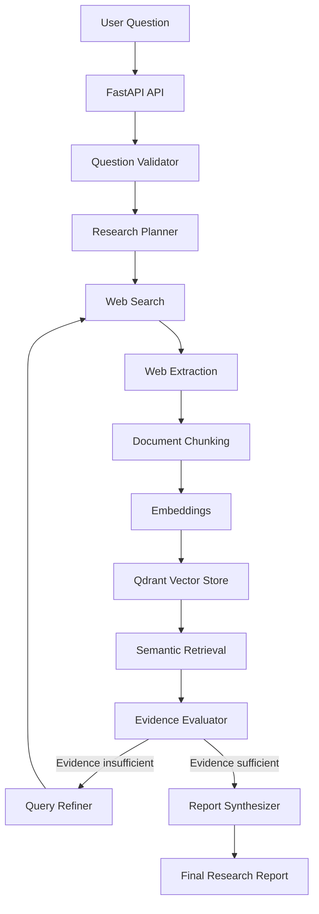

# Autonomous AI Research Agent

An autonomous AI research system that investigates research questions using web search, document extraction, semantic retrieval, evidence evaluation, iterative query refinement, and LLM-based report generation.

The project is built as an **agentic RAG pipeline using LangGraph**, with a FastAPI backend and React frontend.

## Features

* Research-question validation
* Autonomous research planning
* Multiple web-search queries
* Webpage extraction and cleaning
* Document chunking
* Semantic embeddings
* Vector storage and similarity search with Qdrant
* Evidence sufficiency evaluation
* Iterative query refinement
* Source-aware report generation
* FastAPI REST API
* React + Vite frontend
* Dockerized backend
* Component-level tests

---

## Architecture



### Research workflow

1. **Question Validator**
   Determines whether the user's request requires external research.

2. **Research Planner**
   Creates the research objective, sub-questions, and search queries.

3. **Web Search**
   Searches external sources using Tavily.

4. **Web Extraction**
   Retrieves webpage content using Requests and BeautifulSoup.

5. **Ingestion**
   Cleans and splits documents into chunks and generates embeddings.

6. **Vector Storage**
   Stores research chunks and metadata in Qdrant.

7. **Retrieval**
   Performs semantic similarity search against the collected research.

8. **Evidence Evaluation**
   Determines whether the retrieved evidence is sufficient to answer the question.

9. **Query Refinement**
   If the evidence is insufficient, the agent generates improved queries and performs another research iteration.

10. **Report Synthesis**
    Generates the final research report using the retrieved evidence and source information.

---

## Tech Stack

### Backend

* Python
* FastAPI
* Uvicorn
* Pydantic
* uv

### Agent Orchestration

* LangGraph

### LLM

* Groq
* OpenAI GPT-OSS-120B through Groq

### Web Research

* Tavily
* Requests
* BeautifulSoup

### RAG

* Sentence Transformers
* Qdrant
* LangChain Text Splitters

### Frontend

* React
* Vite
* Tailwind CSS

### Development & Deployment

* Git
* GitHub
* Docker

---

## Project Structure

```text
Autonomous-AI-Research-Agent/
│
├── app/
│   ├── agents/
│   │   ├── evaluator.py
│   │   ├── extractor.py
│   │   ├── graph.py
│   │   ├── ingestor.py
│   │   ├── planner.py
│   │   ├── query_refiner.py
│   │   ├── question_validator.py
│   │   ├── research_agent.py
│   │   ├── retriever.py
│   │   ├── state.py
│   │   └── synthesizer.py
│   │
│   ├── prompts/
│   │   ├── evaluator.py
│   │   ├── planner.py
│   │   ├── query_refiner.py
│   │   └── synthesizer.py
│   │
│   ├── rag/
│   │   ├── check_points.py
│   │   ├── chunker.py
│   │   ├── embeddings.py
│   │   ├── retriever.py
│   │   └── vector_store.py
│   │
│   └── tools/
│       ├── web_search.py
│       └── web_scraper.py
│
├── frontend/
│   ├── src/
│   ├── public/
│   ├── package.json
│   └── vite.config.js
│
├── main.py
├── Dockerfile
├── .dockerignore
├── .gitignore
├── pyproject.toml
├── uv.lock
└── README.md
```

---

# Getting Started

## Prerequisites

Install:

* Python 3.13+
* Git
* uv
* Node.js and npm
* Docker Desktop (optional, for containerized backend)

You also need API access for:

* Groq
* Tavily
* Qdrant

---

# Environment Variables

Create a `.env` file in the project root:

```env
GROQ_API_KEY=your_groq_api_key
TAVILY_API_KEY=your_tavily_api_key
QDRANT_URL=your_qdrant_url
QDRANT_API_KEY=your_qdrant_api_key
```

Do **not** commit `.env` or API keys to GitHub.

The repository's `.gitignore` excludes `.env`.

---

# Running Locally

## 1. Clone the repository

```bash
git clone https://github.com/tejasathawale212/Autonomous-AI-Research-Agent.git
cd Autonomous-AI-Research-Agent
```

## 2. Install Python dependencies

```bash
uv sync
```

## 3. Start the backend

```bash
uv run uvicorn main:app --reload
```

The backend will be available at:

```text
http://127.0.0.1:8000
```

FastAPI interactive documentation:

```text
http://127.0.0.1:8000/docs
```

---

# Running the Frontend

Open another terminal:

```bash
cd frontend
npm install
npm run dev
```

The frontend will normally be available at:

```text
http://localhost:5173
```

The frontend communicates with the FastAPI backend.

---

# Running with Docker

The current Docker configuration containerizes the **FastAPI backend**.

The React frontend currently runs separately using Vite.

## 1. Build the Docker image

From the project root:

```bash
docker build -t autonomous-research-agent .
```

## 2. Run the backend container

Use the `.env` file to provide the required API keys:

```bash
docker run --rm -p 8000:8000 --env-file .env autonomous-research-agent
```

The backend will then be available at:

```text
http://localhost:8000
```

FastAPI documentation:

```text
http://localhost:8000/docs
```

### Docker architecture

```text
┌─────────────────────────────┐
│        React Frontend       │
│       localhost:5173        │
└──────────────┬──────────────┘
               │ HTTP
               ▼
┌─────────────────────────────┐
│      FastAPI Container      │
│       localhost:8000        │
│                             │
│        LangGraph            │
│        Groq                 │
│        Tavily               │
│        RAG                  │
│        Qdrant Client        │
└──────────────┬──────────────┘
               │
               ▼
       ┌───────────────┐
       │ Qdrant Server │
       │ / Cloud       │
       └───────────────┘
```

The current application connects to Qdrant using the configured `QDRANT_URL` and `QDRANT_API_KEY`; the Dockerfile does not start a Qdrant server itself.

---

# API

## `GET /`

Health/root endpoint.

```http
GET /
```

Example response:

```json
{
  "message": "Autonomous AI Research Agent API is running"
}
```

---

## `POST /research`

Starts a research workflow.

### Request

```json
{
  "question": "What are the main challenges of deploying AI agents in enterprises?"
}
```

### Example using cURL

```bash
curl -X POST "http://localhost:8000/research" \
  -H "Content-Type: application/json" \
  -d "{\"question\":\"What are the main challenges of deploying AI agents in enterprises?\"}"
```

### Response

The endpoint returns:

* The generated research report
* The sources collected during the research process

Example structure:

```json
{
  "result": "Generated research report...",
  "sources": [
    {
      "title": "Example Source",
      "url": "https://example.com",
      "query": "enterprise AI agent challenges"
    }
  ]
}
```

---

# RAG Pipeline

The project uses a retrieval-augmented generation workflow.

```text
Web Sources
     ↓
Extracted Documents
     ↓
Cleaned Text
     ↓
Text Chunks
     ↓
Embeddings
     ↓
Qdrant
     ↓
Semantic Retrieval
     ↓
Relevant Evidence
     ↓
LLM
     ↓
Research Report
```

Each research run stores metadata alongside chunks, including source information and the research identifier, allowing retrieved evidence to be associated with its original research run.

---

# Agent State

The LangGraph workflow maintains research state containing information such as:

* Research ID
* Original question
* Research objective
* Sub-questions
* Search queries
* Sources
* Documents
* Chunks
* Retrieved context
* Findings
* Evidence sufficiency
* Research iteration count
* Final report

This allows the research workflow to make decisions based on the current state and repeat the search process when additional evidence is required.

---

# Testing

The project contains tests for several research-agent and RAG components.

Run the test suite with:

```bash
uv run pytest
```

For a specific test file:

```bash
uv run pytest app/agents/test_graph.py
```

---

# Docker Notes

The current Docker image prioritizes a working ML environment rather than minimum image size.

The project uses Sentence Transformers for local embeddings, which brings substantial machine-learning dependencies into the container.

Docker image-size optimization is planned as a future improvement.

The `.dockerignore` file prevents development artifacts such as virtual environments, Node modules, caches, and local build output from being sent as Docker build context.

---

# Current Status

### Implemented

* [x] FastAPI backend
* [x] LangGraph research workflow
* [x] Research-question validation
* [x] Research planning
* [x] Tavily web search
* [x] Web extraction
* [x] Document chunking
* [x] Sentence Transformer embeddings
* [x] Qdrant vector storage
* [x] Semantic retrieval
* [x] Evidence evaluation
* [x] Query refinement
* [x] Source-aware report generation
* [x] React frontend
* [x] Dockerized backend
* [x] Automated tests for core components
* [x] GitHub repository

### Planned Improvements

* [ ] Reduce Docker image size
* [ ] Docker Compose for frontend and backend
* [ ] More comprehensive automated evaluation
* [ ] Source and citation validation improvements
* [ ] Structured observability and tracing
* [ ] Production deployment
* [ ] Authentication and authorization
* [ ] MCP-based external research tools
* [ ] Advanced research memory
* [ ] Improved agent planning and research iteration

---

# Security

Never commit credentials or API keys.

Keep secrets in `.env` during local development and pass them to Docker using:

```bash
docker run --env-file .env ...
```

Do not place real API keys inside source code, Dockerfiles, README files, or GitHub repositories.

---

# Project Goals

This project was built to explore production-oriented AI engineering concepts including:

* Agentic workflows
* Retrieval-Augmented Generation (RAG)
* Vector databases
* Web research automation
* LLM tool usage
* Evidence-based generation
* Iterative research
* API development
* Containerization
* AI application architecture

---

# Author

**Tejas Athawale**

GitHub:
https://github.com/tejasathawale212

Project Repository:
https://github.com/tejasathawale212/Autonomous-AI-Research-Agent
